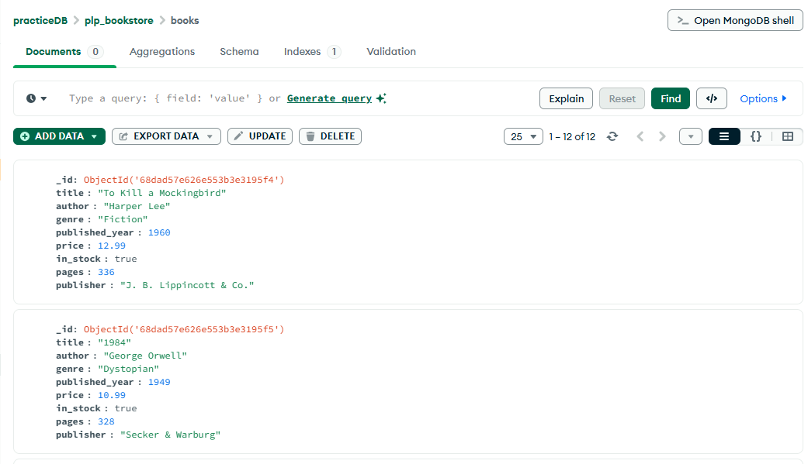
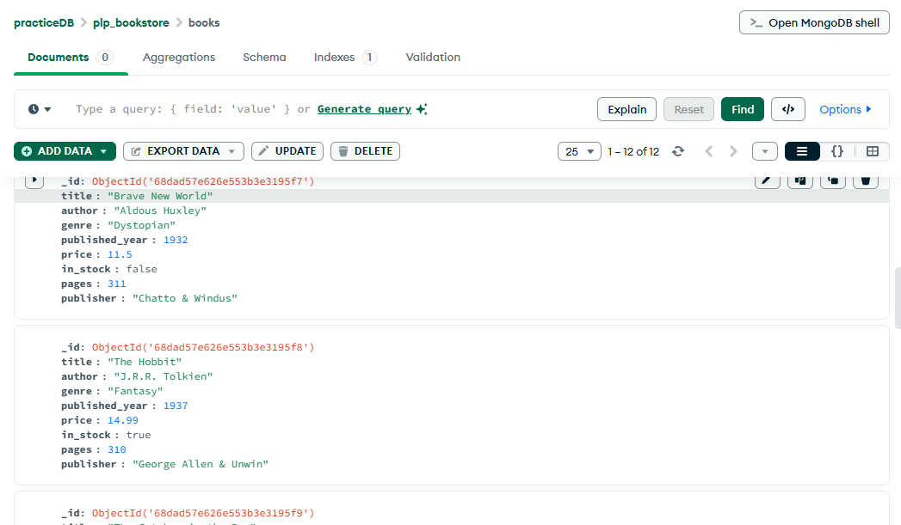

# MongoDB Fundamentals - Week 1

## Setup Instructions

Before you begin this assignment, please make sure you have the following installed:

1. **MongoDB Community Edition** - [Installation Guide](https://www.mongodb.com/docs/manual/administration/install-community/)
2. **MongoDB Shell (mongosh)** - This is included with MongoDB Community Edition
3. **Node.js** - [Download here](https://nodejs.org/)

### Node.js Package Setup

Once you have Node.js installed, run the following commands in your assignment directory:

```bash
# Initialize a package.json file
npm init -y

# Install the MongoDB Node.js driver
npm install mongodb
```

## Assignment Overview

This week focuses on MongoDB fundamentals including:

- Creating and connecting to MongoDB databases
- CRUD operations (Create, Read, Update, Delete)
- MongoDB queries and filters
- Aggregation pipelines
- Indexing for performance

## Submission

Complete all the exercises in this assignment and push your code to GitHub using the provided GitHub Classroom link.

## Getting Started

1. Accept the GitHub Classroom assignment invitation
2. Clone your personal repository that was created by GitHub Classroom
3. Install MongoDB locally or set up a MongoDB Atlas account
4. Run the provided `insert_books.js` script to populate your database
5. Complete the tasks in the assignment document

## Files Included

- `Week1-Assignment.md`: Detailed assignment instructions
- `insert_books.js`: Script to populate your MongoDB database with sample book data
- `queries.js`: Contains all required MongoDB queries for CRUD, advanced queries, aggregation, and indexing

## How to Run the Scripts

### 1. Populate the Database

Run the following command in your terminal to insert sample book data into your MongoDB database:

```bash
node insert_books.js
```

This will connect to your local MongoDB instance (or update the URI in the script for Atlas) and insert the sample books into the `plp_bookstore.books` collection.

### 2. Run MongoDB Queries

Open the `queries.js` file. Copy and paste the queries into your MongoDB Shell (`mongosh`) or use MongoDB Compass's "Aggregations" and "Filter" features to run them against your `plp_bookstore` database.

### 3. Submission Requirements

You must submit the following files:

- `insert_books.js` (with your modifications if any)
- `queries.js` (containing all your MongoDB queries)
- `README.md` (this file, explaining how to run your scripts)
- A screenshot of your MongoDB Compass or Atlas showing your collections and sample data

#### 📸 MongoDB Compass Screenshots

Below are screenshots showing the `plp_bookstore` database and the `books` collection with sample data in MongoDB Compass:




## Requirements

- Node.js (v18 or higher)
- MongoDB (local installation or Atlas account)
- MongoDB Shell (mongosh) or MongoDB Compass

## Resources

- [MongoDB Documentation](https://docs.mongodb.com/)
- [MongoDB University](https://university.mongodb.com/)
- [MongoDB Node.js Driver](https://mongodb.github.io/node-mongodb-native/)
