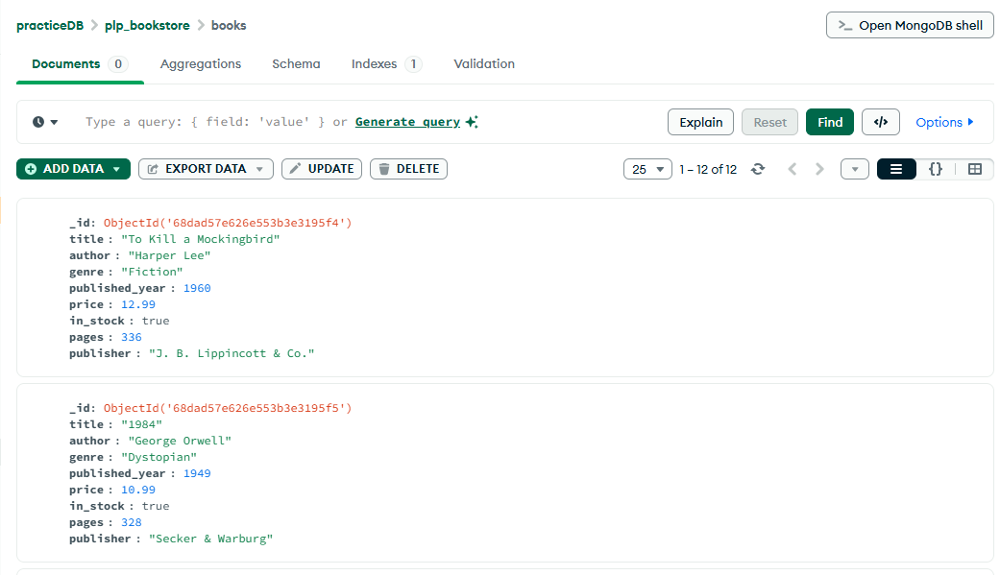

# 🗄️ Week 1: MongoDB – Data Layer Fundamentals and Advanced Techniques

## 🚀 Objective

Learn the fundamentals of MongoDB, including installation, creating collections, performing CRUD operations, using aggregation pipelines, and implementing indexing for performance optimization.

## 📂 Tasks

### Task 1: MongoDB Setup

- Install MongoDB on your local machine OR set up a free MongoDB Atlas cluster
- Create a new database called `plp_bookstore`
- Create a collection called `books`

### Task 2: Basic CRUD Operations

- Use the provided `insert_books.js` script to insert at least 10 book documents into your collection
- Each book should have the following fields:
  - `title` (string)
  - `author` (string)
  - `genre` (string)
  - `published_year` (number)
  - `price` (number)
  - `in_stock` (boolean)
  - `pages` (number)
  - `publisher` (string)
- Write MongoDB queries to:
  - Find all books in a specific genre
  - Find books published after a certain year
  - Find books by a specific author
  - Update the price of a specific book
  - Delete a book by its title

### Task 3: Advanced Queries

- Write a query to find books that are both in stock and published after 2010
- Use projection to return only the title, author, and price fields in your queries
- Implement sorting to display books by price (both ascending and descending)
- Use the `limit` and `skip` methods to implement pagination (5 books per page)

### Task 4: Aggregation Pipeline

- Create an aggregation pipeline to calculate the average price of books by genre
- Create an aggregation pipeline to find the author with the most books in the collection
- Implement a pipeline that groups books by publication decade and counts them

### Task 5: Indexing

- Create an index on the `title` field for faster searches
- Create a compound index on `author` and `published_year`
- Use the `explain()` method to demonstrate the performance improvement with your indexes

## 🧪 Expected Outcome

- A functioning MongoDB database with properly structured data
- A set of MongoDB queries that demonstrate your understanding of CRUD operations
- Advanced queries showing filtering, projection, and sorting capabilities
- Aggregation pipelines that transform and analyze the data
- Properly implemented indexes with performance analysis

## 🛠️ Setup

1. Install MongoDB Community Edition or set up a MongoDB Atlas account
2. Use the provided `insert_books.js` script to populate your database
3. Use MongoDB Shell (mongosh) or MongoDB Compass to interact with your database
4. Save all your queries in a file called `queries.js`

## ✅ Submission Instructions

1. Accept the GitHub Classroom assignment invitation
2. Clone your personal repository that was created by GitHub Classroom
3. Add the following files to your repository:
   - `insert_books.js` (with your modifications if any)
   - `queries.js` (containing all your MongoDB queries)
   - A `README.md` file explaining how to run your scripts
   - A screenshot of your MongoDB Compass or Atlas showing your collections and sample data
4. Commit and push your changes to GitHub
5. Your submission will be automatically graded based on the criteria in the autograding configuration
6. The instructor will review your submission after the autograding is complete

## 📸 MongoDB Compass Screenshot

Below are screenshots showing the `plp_bookstore` database and the `books` collection with sample data in MongoDB Compass:

